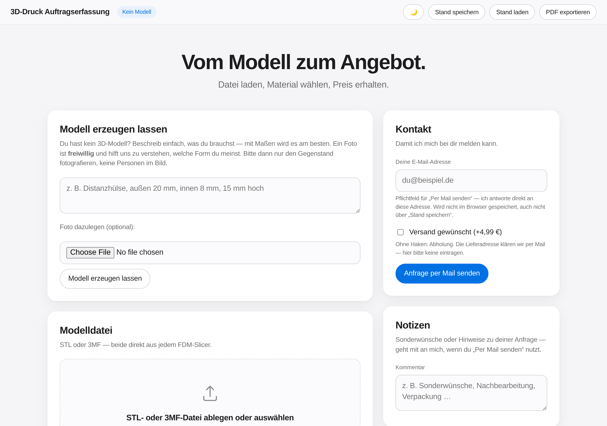

# 3D-Druck Auftragserfassung

Zwei HTML-Dateien zum Erfassen und Kalkulieren von 3D-Druckaufträgen, die über eBay, Etsy
oder Amazon hereinkommen. Kein CDN, keine Installation — Datei herunterladen, Doppelklick,
fertig. Alle Daten bleiben lokal im Browser. Zwei Funktionen (Server-Backup, Mail-Versand mit
Anhang) brauchen zusätzlich den kleinen API-Server aus `server/`, siehe
[`NOTIZEN.md`](NOTIZEN.md) — ohne den läuft die App trotzdem komplett offline, nur diese zwei
Extras fehlen dann.

- **`index.html`** — die öffentliche Seite: Modell hochladen, Preis sehen, Material wählen,
  Kontakt-E-Mail eintragen, als PDF exportieren oder direkt per Mail anfragen. Kennt keine
  Auftragsverwaltung.
- **`backend.html`** — Jans eigenes Werkzeug, identisch zu index.html plus Kalkulationsbasis,
  Auftragsdaten und die komplette Auftragsliste (inkl. Frist-Countdown zum Sortieren). Öffnet
  er selbst, wenn eine Anfrage reingekommen ist — nur im Heimnetz erreichbar, nicht über die
  öffentliche Domain.

## Ablauf

STL oder 3MF laden → Bambu-Lab-Farbe wählen (legt Material gleich mit fest) → Preis
steht sofort oben, ganz ohne Scrollen. Fertig geht es raus als PDF oder direkt per Mail mit
Anhang — beides in der Kopfzeile, „Per Mail senden“ ist hervorgehoben. Im Backend stecken
Aufträge, Auftragsdaten und die Kalkulationsbasis zusätzlich bei Bedarf hinter einem Pfeil,
damit der Kopf der Seite aufgeräumt bleibt.

## Funktionen

- **Modell:** STL (binär + ASCII) und 3MF per Drag-and-drop, eigener Parser (auch für
  3MF-Dateien, die die Geometrie in eine separate Datei im Archiv auslagern, z. B. aus
  Bambu Studio), eigene 3D-Vorschau (Canvas-Software-Renderer). Warnt bei nicht
  wasserdichten Meshes und bei Teilen, die den eingestellten Bauraum sprengen
  (90°-Drehung wird berücksichtigt).
- **Kalkulation:** Material, Strom, Maschinenzeit, Rüsten, Marge, MwSt. — steht direkt
  oben im Blick, keine Plattformgebühr. Die Druckzeit-Schätzung lässt sich durch die
  echte Slicer-Zeit übersteuern.
- **Material & Farbe:** nur die 90 offiziellen Bambu-Lab-Farben (PLA Basic/Matte/CF/
  Translucent/Pure, PETG Basic/CF), gruppiert nach Linie mit Preis pro kg — die
  Farbwahl legt Material (Preis, Dichte, Tempo) und Farbe in einem Schritt fest, es
  lässt sich nichts drucken, was nicht auch gekauft werden kann.
- **Aufträge (nur im Backend):** CSV-Import der Bestellexporte von eBay/Etsy/Amazon,
  Auftragsliste mit Status/Suche/Filter, Frist-Countdown zum Sortieren nach Dringlichkeit,
  Duplizieren für Wiederholungskäufe, Komplett-Backup als JSON, Umsatz-CSV für die Buchhaltung.
- **PDF & Mail:** einseitiges A4-Auftragsblatt über den Druckdialog, oder direkter
  Mail-Versand mit echtem Anhang (Modell als STL, aktueller Stand als JSON) über den
  API-Server auf dem Pi (Resend-API) — kein manuelles Anhängen mehr nötig. Die eingetragene
  Kontakt-E-Mail geht als Antwortadresse mit, eine normale Antwort im Mailprogramm erreicht
  damit direkt den Kunden.
- **Darstellung:** folgt automatisch dem System, manueller Hell/Dunkel-Umschalter im
  Header überschreibt das bei Bedarf.

Details zu Rechenmodell, Grenzen und Entscheidungen: [`NOTIZEN.md`](NOTIZEN.md).

28 Ende-zu-Ende-Tests fahren beide Seiten headless durch: Volumenberechnung (STL + 3MF,
auch mit ausgelagerter Geometrie), Wasserdichtheits- und Bauraum-Warnung, CSV-Import,
Auftragsliste, Frist-Countdown/-Sortierung, Backup, Migration, Darstellungs-Umschalter,
Mail-Versand inkl. Kontakt-E-Mail-Pflichtfeld. Sie laufen bei jedem Push automatisch über
GitHub Actions.
